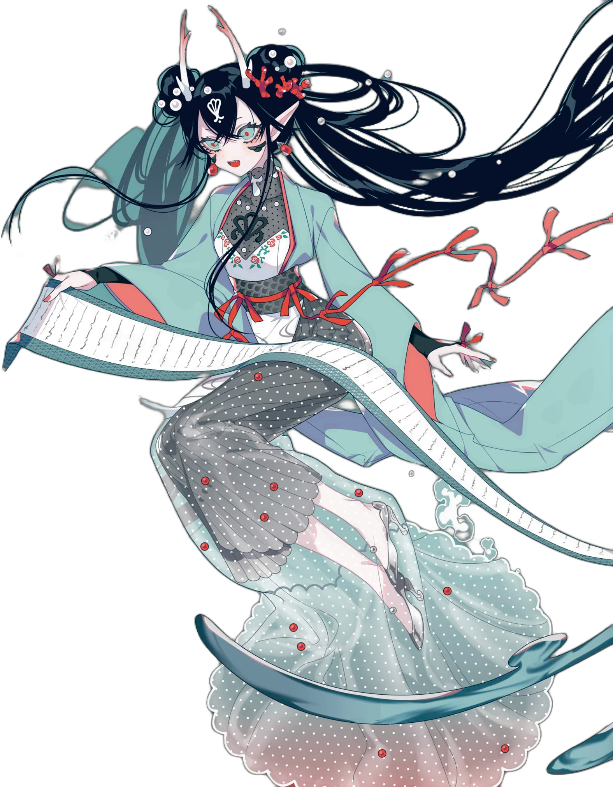

## Ciallo～(∠・ω< )⌒★

I'm Spark, an undergraduate at University of Michigan. My nickname is Kyanites, which means  is a typically blue aluminosilicate mineral. I take this name from my favorite animation Suka Suka.

Currently, my interest lies in control theory, optimization, AI for Science, mathematics and physics. I've worked on projects related with predicting fuel characteristics with machine learning and am experienced in being teaching assistant. I am applying for graduate programs and expect to graduate in the Summer of 2025. Please reach out to me if you are looking for Ph.D. students.

Outside academia, my interests include reading novel, playing badminton, tennis and table tennis, and traveling. One of my favorite novelist is Izumi Kyoka, whose novels are idealistic and romantic.

My CV can be found [here][[CV.pdf (nephren17.github.io)].

    

    
    

